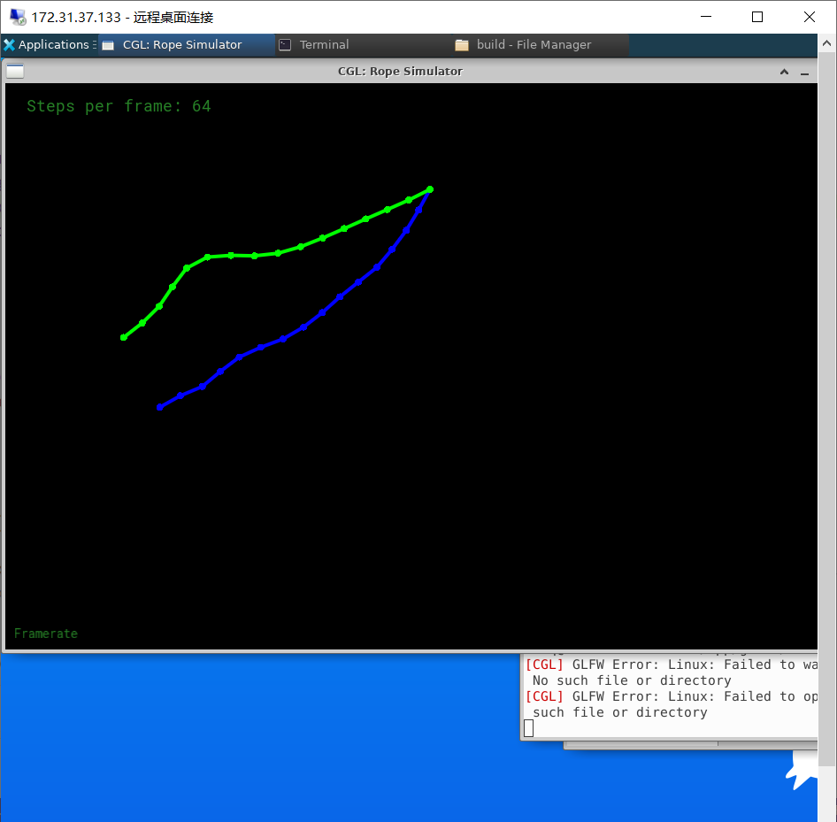

# HW 5 : Ray-Triangle Intersection
## 1 Whited-Style Ray Tracing

## 2 $\bf{M\ddot{o}ller\ Trumbore\ Algorithm}:$
The intersection equation to be solved:
$$
\vec{o} + t\vec{D} = (1-b_1-b_2)\vec{P_0} + b_1\vec{P_1} + b_2\vec{P_2}
$$

Using the Cramer's Rule to deal with this cubic linear equation. Here's a detailed calculation:

$$
\begin{aligned}
\vec{O} - \vec{P_0} &=  
\left[
    \begin{array}{cccc} 
    \vec{P_1} - \vec{P_0} & \vec{P_2} - \vec{P_0} & -\vec{D}
    \end{array}
\right]
\left[
    \begin{array}{cccc} b_1 \\ 
    b_2 \\ 
    t 
    \end{array}
\right]\\
\vec{S} &=  
\left[
    \begin{array}{cccc} 
    \vec{E_1} & \vec{E_2} & -\vec{D}
    \end{array}
\right]
\left[
    \begin{array}{cccc} b_1 \\ 
    b_2 \\ 
    t 
    \end{array}
\right]\\
\end{aligned}
$$

Still for simplicity, 

$$
\vec{S_1} = \vec{D} \times \vec{E_2},\
\vec{S_2} = \vec{S} \times \vec{E_1}
$$

Thus we get,

$$
\left[
    \begin{array}{cccc} t \\ 
    b_1 \\ 
    b_2
    \end{array}
\right]
= \frac{1}{\vec{S_1}\cdot\vec{E_1}}
\left[
    \begin{array}{cccc} \vec{S_2}\cdot\vec{E_2} \\ 
    \vec{S_1}\cdot\vec{S} \\ 
    \vec{S_2}\cdot\vec{D}
    \end{array}
\right]
$$

This is purely application of Cramer's Rule and might includes a trival swap by scalar triple product.