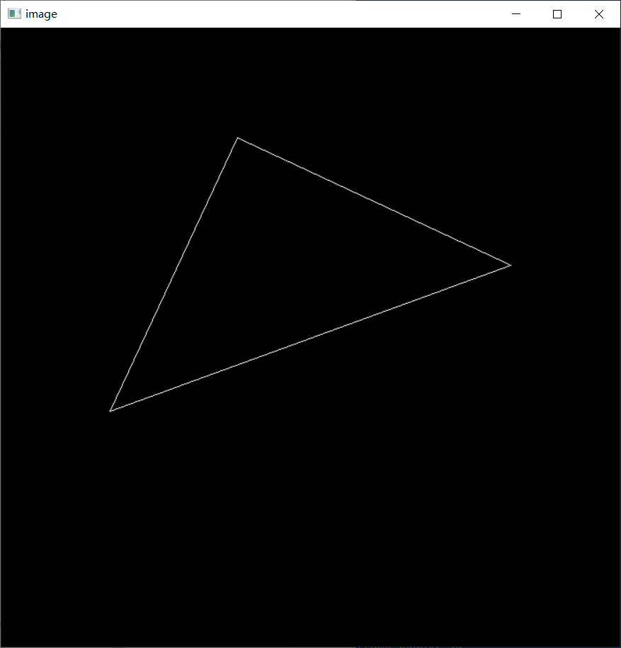
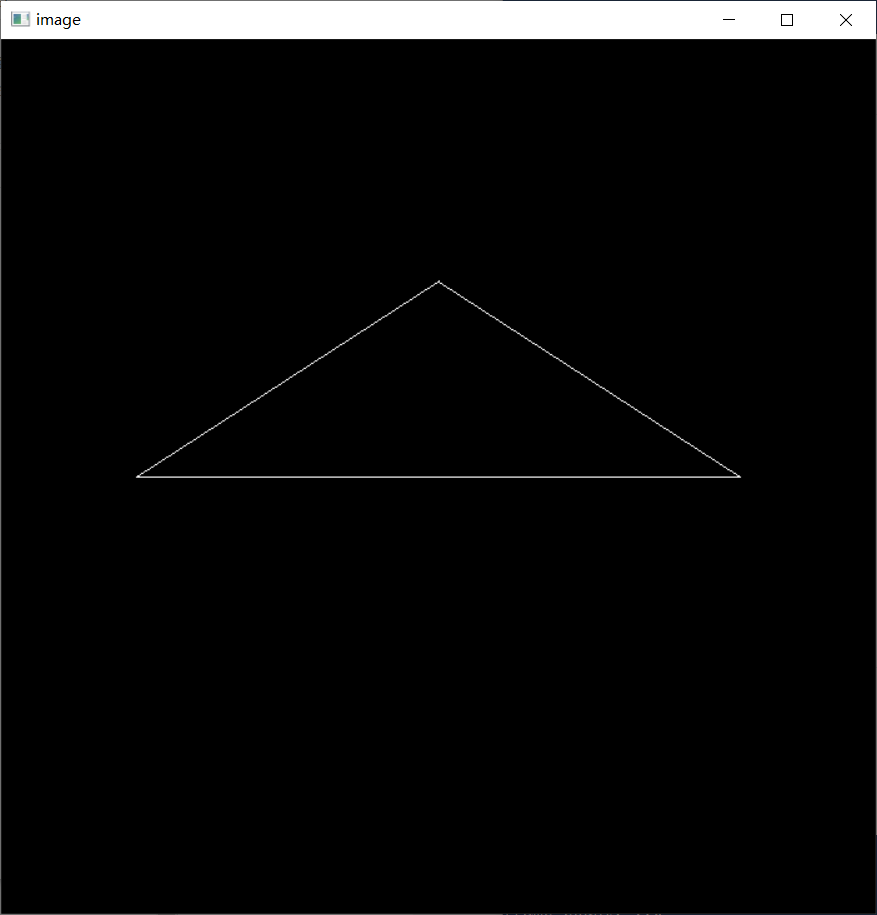

# **HW1 : Translation and Projection**

##  **1 Implementation of Model Matrix**
**Rotational matrix** along the **z-axis**:

$$
        \bf{M}=\bf{R}_z(\alpha)=
 \left[
  \begin{matrix}
    \cos{\alpha} & -\sin{\alpha} & 0 & 0 \\
    \sin{\alpha} & \cos{\alpha} & 0 & 0 \\
    0 & 0 & 1 & 0\\
    0 & 0 & 0 & 1
  \end{matrix}
\right]
$$


## **2 Implementation of Projection matrix**
### **2.1 Perspective Matrix:**

squish the ***frustum*** into a ***cuboid:***

$$
Pers=
 \left[
  \begin{matrix}
    n & 0 & 0 & 0 \\
    0 & n & 0 & 0 \\
    0 & 0 & n+f & -nf\\
    0 & 0 & 1 & 0
  \end{matrix}
\right]
$$
### **2.2 Orthographic Matrix:**

First, ***translate***, next, ***scale***, then turn the ***cuboid*** into a ***canonical cuboid***

**!! [Caution]: the order of operation!!**

Finally, we get:

$$
Orth=scale * trans
 \left[
  \begin{matrix}
    \frac{2}{r-l} & 0 & 0 & \frac{r+l}{r-l} \\
    0 & \frac{2}{t-d} & 0 & \frac{t+d}{t-d} \\
    0 & 0 & \frac{2}{n-f} & \frac{n+f}{n-f}\\
    0 & 0 & 0 & 1
  \end{matrix}
\right]
$$
```cpp
return ortho * Pers;
```
## **3 successfully compile & run**
 


## **4 enable z-axis rotate control by 'A' and 'D'**
 

This result is led by model tranformation

## **5 rotate along any axis (enable x-axis rotate control by 'A' and 'D')**
 

An x-axis rotation controlled by the **Rodrigues' Formula:**

$$
\bf{R}(\bf{\vec{n}},\alpha) = \cos{\alpha}\bf{I} + (1 - \cos{\alpha})\bf{n}\bf{n^T} + \sin{\alpha}
 \left[
  \begin{matrix}
    0 & -n_z & n_y \\
    n_z & 0 & -n_x \\
    -n_y & n_x & 0
  \end{matrix}
\right]
$$

For proof, [here](https://sites.cs.ucsb.edu/~lingqi/teaching/resources/GAMES101_Lecture_04_supp.pdf) is for a hint  given by Prof. Yan. 

Also, be ware of the consitence between $\bf{n}\times() $ and $\bf{\Omega(n)}\cdot()$.
