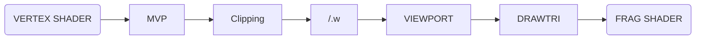
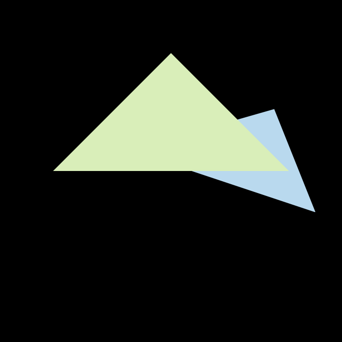

# **HW2 : Triangles and Z-buffering**

## **1 Rasterizing Algorithm for Triangle**



A trival shading is to check each pixel whether it is inside the triangle or not. 


The drawback lies that triangles are jaggie on the edge. We can see aliasing especially on the edge of blue triangle.

## **2 Inside the Triangle or Not ?**

It is easy to recall the *cross product* when judgeing whether inside or outside of an object. Here is a piece of code for reference.

```cpp
    f01 = v[0].cross(v[1]);
    f12 = v[1].cross(v[2]);
    f20 = v[2].cross(v[0]);

    if(p.dot(f01) * v[2].dot(f01) > 0 && p.dot(f12) * v[0].dot(f12) > 0 && p.dot(f20) * v[1].dot(f20) > 0) {
        return true;
    }
```

In fact, `f01, f12, f20` decides oneside of a Volumn.

Cause for a reason, cross product is defined in a 3D space. It's okay to place the triangle with any posture in space. For simplicity, we give them with `z = 1`. Thus, with`z = 1`, point `p` can be fixed on the plance decided by this triangle.

Then, recall the Volumn defined by `f01, f12, f20` and this Triangle. We can translate the statement `p is inside the triangle` into 

> For each face $f_{ij}$ defined by $i$ and $j,$ we assert that **the remain vertex of triangle $k(k\neq{i,j})$ and point $p$ should lies on the same side**.

This view helps us write an elegant logics.

## **3 Setting z-buffer to Keep the Order**

The figure about obeys the rule. It's nothing worthy to say.

## **4 Super-Sampling Anti-Aliasing**

SSAA (super-sampling anti-aliasing) is implemented in this part.

### 4.1 A Typical Fault

First, we provide a typical wrong answer as a remainder.
```cpp
//N x N ssaa
int depth = depth_buf[get_index(i, j)];
int cnt = 0;
for([i,j] = ...){
    if (z_interpolated > depth) {
            depth = z_interpolated;
            cnt++;
    }
}
if(depth > depth_buf[get_index(i, j)]{
    depth_buf[get_index(i, j)] = depth;
    percent = 1.f / N / N;
    set_pixel({ float(i), float(j), 0 }, t.getColor() * percent + frame_buf[get_index(i, j)] * (1-percent));
}
```


We can see this work successfully murmured the blue's edge, however, introducing a abanormal black line.

From some [reference materials](https://blog.csdn.net/Xuuuuuuuuuuu/article/details/124172397) mentioned we can see, during the shading procedure, imagine a pixel lies on both the black background (3/4 occupied) and green triangle(1/4 occupied). From the above code, depth_buf would be cashed for there is exactly one sub-pixel has depth lager than the original. This causes a less than normal estimate.
And later, it would not be rectified because the blue think, "Oh, it has a larger depth than me, i won't change it."

### 4.2 SSAA

To avoid this error, we need cashed `ss_depth_buf` and `s__frame_buf` for each sub-pixel so that we actualy keep a super-solution figure. Finally, do average operation for each pixel, and we get a SSAA results.



The detailed implemnt can be referenced in the code files.

FYI, SSAA (super-sampling anti-aliasing) is slightly different from MSAA (Multi-sampling Anti-aliasing). More reading materials needed for a better comprehension.