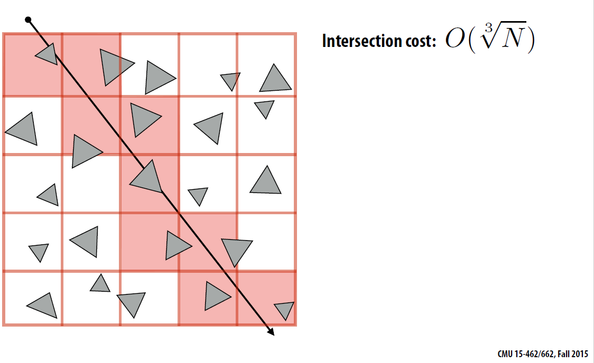
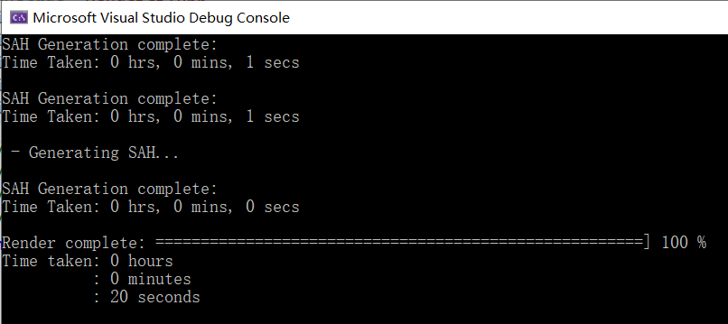

# HW6 : Accelerating Architecture

## 1 Uniform Space Partion (Grid)

Heuristic : Choose number of voxels ~ total number of primitives
## 2 Spatial Partion

Oct-Tree, KD-Tree, BSP-Tree, etc.

- Partitions space into disjoint regions
(primitives may be contained in
multiple regions of space)

## 3 Primitive Partion / Object Partion

Primitive partitioning (bounding
volume hierarchy): partitions node’s
primitives into disjoint sets (but sets
may overlap in space)

## 3.1 Naive Bounding Volume Heirarchy (BVH)

Heuristic : choose the element at the middle, and get two disjoint sub-tree. A quick-sort algorithm may be helpful.

## 3.2 Suface Area Heuristic (SAH)

Heuristic : choose the element so that we get the cost minimized.

$$
Cost = C_{tranv} + N_AP_AC_{isec} + N_BP_BC_{isec}
$$

For it easy,

$$
C =N_AS_A + N_BS_B
$$

It follows these assumptions (that may not hold in practice):
- Rays are randomly distributed
- Rays are not occluded

Thus, surface is thought be propotional to the possibility of ray intersection.

## 3.2 Efficiency

As the cost function defined above, we implement the algorithm to make a better division with less cost.

### 3.2.1 Naive BVH

### 3.2.2 SAH

Truly, SAH building process is much slower than naive BVH. It is surely the difference between building cost would be larger if big model included.

During this job, we find SAH 2s faster than naive BVH. It is not apparent for usage of this algorithm, though. As detailed mentioned in [Computer Graphics by CMU](http://15462.courses.cs.cmu.edu/fall2015/lecture/acceleration/), some specific scenes would be suitable for SAH.