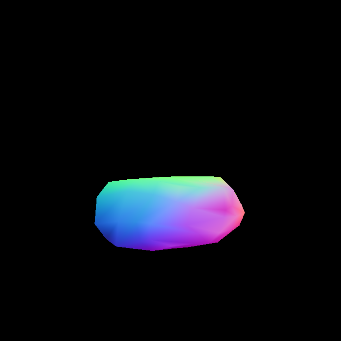

# HW3 : Pipeline and Shading

## Preface: Fragment Processing

(The following description only expressed personal ideas.)

The triangle, who passed through a rasterizer, is been recogonized as a fragment. The rasterizer checked pixel-by-pixel if it is `insideTri()`. 

Thus, we get a fragment, which truly represent a 'triangle, however, a pixel or *rasterized* form. 

Now, during the fragment processing, we can do a bunch of things, shading, texture mapping, etc. A intuition is that after this procedure, we get object colored!

## Implementation of Physical Quantity Interpolation

### 1.1 Interpolation through Barycentric Coordinates

There're only some hints for look-up later. 

Such as, the dimension of a triangle in derterminate form:

$$
A = \frac{1}{2}
\begin{vmatrix} 
    1 & x_i & y_i \\
    1 & x_j & y_j \\
    1 & x_k & y_k
\end{vmatrix}
$$

This works when dimention interpolates.

## 1.2 ***Example of Normal Shader***

### 1.2 Perspective Correction

You should bear in mind the idea, that Barycentric interpolation is **not invariant** during perspective projection, while detailed formule can be looked up anywhere.

An elegent proof is included in [material](https://blog.csdn.net/Q_pril/article/details/123598746).

## 2 Blinn-Phong Shading Model

It can be seperated in three part.

### 2.1 Diffuse Term

Diffuse discrbes the scattering light.

$$
    \bf{L_d} = k_d(\bf{I}/R^2)\bf{(\vec{n}\cdot\vec{l})}

$$

The relation between light direction and surface normal, would decide how many energy recieved. It also called ***Lambert's Law***.

### 2.2 Specular Term

$$
    \bf{L_s} = k_s(\bf{I}/R^2)\bf{(\vec{n}\cdot\vec{h})}^p
$$

$\bf\vec{h}$, the halfway vector, means the a bisector(normalized) of angle which is consist of view direction, light direction and shading point. p is a parameter decides the concentration of specular reflection domain.

### 2.3 Ambient Lighting Term

$$
    \bf{L_a} = k_a\bf{I_a}
$$

This is non-physical but easy to understand. Adding a constant to fit the lighting with human's feeling. 

Tips: 
1. Shading is local. Shading ≠ Shadow.
2. Phong shading only behaves different from Blinn-Phong stratege during the cosine value in specular term:
$$
    \bf{L_s} = k_s(\bf{I}/R^2)\bf{(\vec{r}\cdot\vec{v})}^p
$$
$\bf\vec{r}$ and $\bf\vec{v}$ indicate the unit vector of **reflection direction** and **view direction**, respectively.

### 2.4 ***Example of Blinn-Phong Shader***

## 3 Texture Mapping

Maning applications work well by a texture mapping. Some usage of them, lighting map, environment map, some mapping trick, cube map. Among of them, the basic texture mapping, andbump map, dispacement map will be included in the latter part.

### 3.1 ***Example of Texture Mapping***

## 4 Shading Frequency

Introducing a new concept *texel*, a basic element in texture. A typical scene lies as the image below. The relation between texel and pixel is varing from nearside to distal.

Also the sampling problem, specifically, pixel is too small for a texture so that we need upsampling the texture to stay from jaggie; ohtherwise, pixel is too big from distal as for a texture, it includes enough texels even we need downsampling, or we get **Moire Pattern**.

Super Sampling always works, but costly. We introduce another two tools.

### 4.1 ***Bilinear Interpolation***

Use linear interpolation from two direction to improve the estimation.

A detailed comparation can be seen as:

(Left: trival texture mapping, Right: use a **bilinear interpolation**)

### 4.2 Mipmap

Mipmap is a fast, approximate range query.
All is in one.

Isotropip mipmap use less than 1/3 additional memory cost.

$$
    L = max(\sqrt{(\frac{\partial u}{\partial x})^2 + (\frac{\partial v}{\partial x})^2}, \sqrt{(\frac{\partial u}{\partial y})^2 + (\frac{\partial v}{\partial y})^2})\\ 
    D = \log_2L
$$

The first relation is given by, seperately assume y is fixed of x is fixed, calculated the problem as $u(x), v(x)$ or $u(y), v(y)$.

Tips. if D is not integral, this issue could also be solve by linear interpolation. We give this binded with the previous bilinear interp a new name, tri-linear interpolation.

## 5 A Few Another Results

### 5.1 Bump Mapping

### 5.2 Displacement Mapping

### 5.3 Bunny Model

### 5.4 Rock Model

